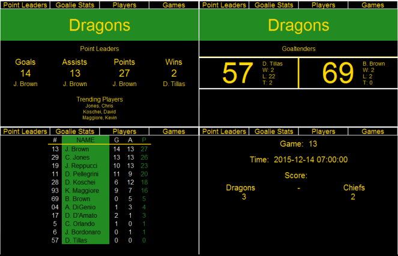

# Interactive Server Project


##Authors
@JDBJohnBrown ~ John Brown

@Aurelas      ~ Michael Antrobus 


##Overview
Display basic information about a beer-league hockey team in a graphically pleasing way.
Information is retrieved from a webpage, and printed dynamically.

##Screenshot



##Concepts Demonstrated
* Players/games are stored with **recursive data structures.**
* **Data astraction** is used by defining lists in "WebsiteCode.rkt" but only providing basic read access to "Main Code.rkt"
* Extensive **functional recursion** is used to parse data passed from the website.


##External Technology and Libraries
[net/url](https://docs.racket-lang.org/net/url.html "net/url") - Racket Library. Used to send PHP_Send commands to [John Brown's Personal Website](http://m.jdbjohnbrown.net)

[m.jdbjohnbrown.net](http:/m.jdbjohnbrown.net "PHP Code") - PHP Code written by myself (John Brown) previously. Used in conjunction with net/url to access a SQL database without hosting the SQL database's password publically on gitHub.
[2htdp/image](https://docs.racket-lang.org/teachpack/2htdpimage.html "2htdp Image") \ [2htdp/universe](https://docs.racket-lang.org/teachpack/2htdpuniverse.html "2htdp Universe") - Racket libraries used to draw our GUI.

##Favorite Scheme Expressions
####John (@JDBJohnBrown)
My favorite part of my coding was my "trending players" algorithm. As a warning, it is not my prettiest code. By the time I finished it I was so done with it I couldn't neaten it up as I did to much else of our code.
The point of this code is to find who the most consistant players have been as of late. When I first created the base of our program, there were 3 different point leaders. I had the team high for goals, and two other players lead in points and assists. However as the season wore on, I took all three titles. This made for a very boring title screen. It was also misleading. Because while I may have the best season stats, I have been cold for over two months. I wanted to know who has been doing well recently comparitively.

The basic idea behind the code is this: 
Each player is given a 2-element list. (P M)
Starting at the team's most recent game, the player is given 8\*M points for each goal (P+=8\*M) and 6*M for each assist.
However, if a player does not score in a game, M is divided by 2, and potential P for the next game back is halved.
This is compare someone who has been hot for three games in a row lately compared to someone who had 20 goals in the first month.

The code becomes complicated due to how dynamic game stats can be.
It works basically like this: For each game, for each player, for each goal, check if the goal or one of the two asists belong to the player. Add points or games missed appropriately.
Stats are stored in order of the players (1-13) in a list like '((P M)(P M).....(P M))
Later, the best three P values are pulled out and used.
```scheme
(define (trending-players-alg)
  (define (player-loop n bool alglst pntlst)    
    (if (null? pntlst)
        (if (not bool)
            (edit-num-list n alglst (list (car (get-num-list n alglst)) (+ 1 (cadr (get-num-list n alglst)))))
            alglst)
        (cond [(= (caar pntlst) n)
               (let ([a (+ (car (get-num-list n alglst)) (/ 8 (expt 2 (cadr (get-num-list n alglst)))))])                 
               (player-loop n #t 
               (edit-num-list n alglst (list a (cadr (get-num-list n alglst))))
               (cdr pntlst)))
               ]
              [(not (null? (cdar pntlst)))
               (if (= (cadar pntlst) n)
                   
                    (player-loop n #t                                 
                    (edit-num-list n alglst (list (+ (car (get-num-list n alglst)) (/ 6 (expt 2 (cadr (get-num-list n alglst))))) (cadr (get-num-list n alglst))))
                    (cdr pntlst))
                    (if (not (null? (cddar pntlst)))
                        (if (= (car (cddar pntlst)) n)
                            
                            (player-loop n #t 
                            (edit-num-list n alglst (list (+ (car (get-num-list n alglst)) (/ 6 (expt 2 (cadr (get-num-list n alglst))))) (cadr (get-num-list n alglst))))
                            (cdr pntlst))
                            (player-loop n bool alglst (cdr pntlst)))
                        (player-loop n bool alglst (cdr pntlst))
              ))]
              [else (player-loop n bool alglst (cdr pntlst))]
    )))
  (define (games-loop alglst gamelst)
      (define (eachPlayer n players alglst pntlst)
        (if (null? players) alglst
            (eachPlayer (+ n 1) (cdr players) (player-loop n #f alglst pntlst) pntlst)
      ))
    (if (null? gamelst) alglst
        (if (null? (list-last (list-last gamelst))) (games-loop alglst (but-last gamelst))
          (games-loop (eachPlayer 1 aP alglst (list-last (list-last gamelst))) (but-last gamelst))))
    )
  (games-loop (create-alg-list) all-games)
  )
```
####Mike (@Aurelas )

```scheme
(define (get-stat player-id f g)
  (define (helper player-id i rank)
    (if (> i (length aP))
        (+ rank 1)
    (if (null? (get-player player-id))
        rank
        (if (null? (get-points (get-player player-id)))
            rank
            (if (null? (get-player i))
                (helper player-id (+ i 1) (length aP))
                    (let ([a (string->number (f (get-player player-id)) 10)]
                          [b (string->number (f (get-player i)) 10)]
                          [c (string->number (g (get-player player-id)) 10)]
                          [d (string->number (g (get-player i)) 10)]
                          [e (get-fullname (get-player player-id))]
                          [f (get-fullname (get-player i))]
                          )
                      (if (equal? e f) (helper player-id (+ i 1 ) (- rank 1))
                      (if (> a b)
                        (helper player-id (+ i 1 ) (- rank 1))
                         (if (and (= a b) (or (> c d) (= player-id 1)))
                            (helper player-id (+ i 1 ) (- rank 1))
                            (helper player-id (+ i 1) rank))
                        )))
                    ))))) 
  (helper player-id 1 (length aP)))
```

##Additional Remarks
Anything else you want to say in your report. Can rename or remove this section.

#How to Download and Run
Download the release named "Final"

Run "Main Code.rkt"
The GUI should open automatically. 

*Due to paying for a cheap webserver, there is a small chance you may get an error "server took too long to respond".
Just retry, it should work the second time.

To use the program, click each of the 4 buttons on the top toolbar to see 4 seperate pages.
On the Player stats page, you can click "#" "G" "A" "P" to sort the stats appropriately.
